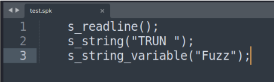
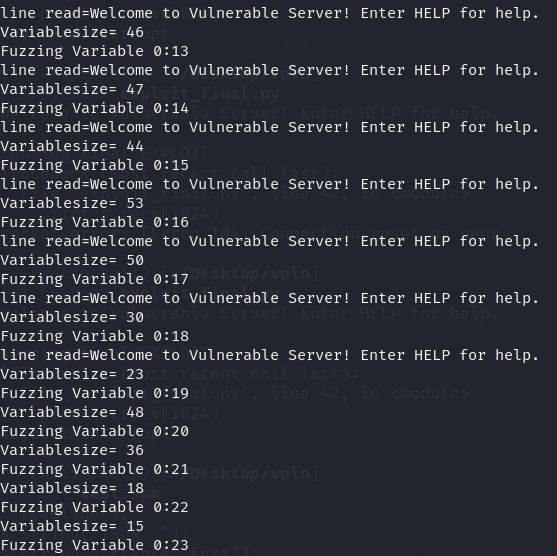

# VulnServer 

We Need Two Virtual Machines Windows 10 , Kali . Download VulnServer [Here](https://thegreycorner.com/vulnserver.html)

In the Windows VM open Cmd go to `vulnserver` directory < Run `vulnserver.exe`.

In the Kali , write this command < HELP
```sh
nc -nv 192.168.242.130 9999
```
Now we have to Find a Crash we do that by Fuzzing , we write a code in `test.spk`.



run the vulnserver < write a command in kali 

```sh
generic_send_tcp <windows vm ip> 9999 test.spk 0 0
```
We then Notice that it crashes after a bunch of inputs 



Now that we got a Crash , Its time to Analyse the Crash for that we use Immunity Debugger [Download](https://www.immunityinc.com/products/debugger/)
Open the Vulnserver.exe in Immunity Debugger.
To Recreate the Crash we write a Python Script : `exploit3.py`

```python

