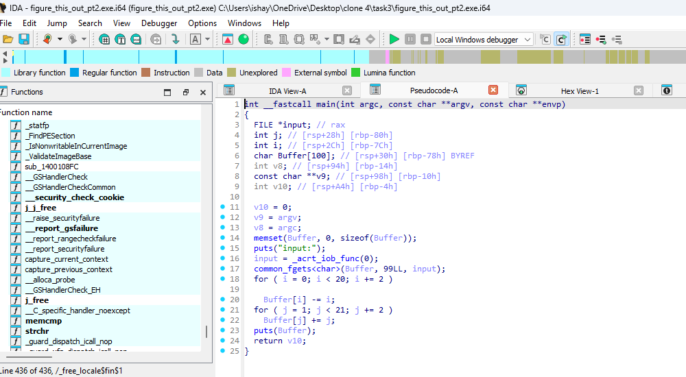

# Task 3
we are doing this task as per [this](https://github.com/Anurag-Chevendra/task3?tab=readme-ov-file) do check it out README and then come here 

We open the `figure_this_out_pt2.exe` in IDA and open its Pseudocode from View < SubViews < generate Pseudocode .
then we analyse all the for loops and pseudocode make necessary changes and run it 
