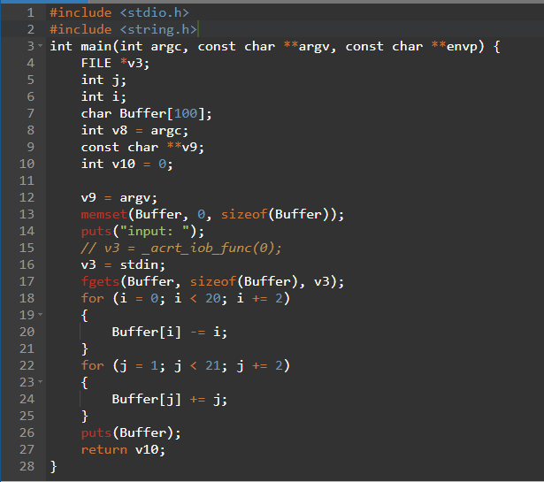
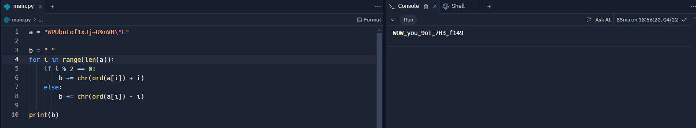

# Task 3
we are doing this task as per [this](https://github.com/Anurag-Chevendra/task3?tab=readme-ov-file) do check it out README and then come here 

We open the `figure_this_out_pt2.exe` in IDA and open its Pseudocode from View < SubViews < generate Pseudocode .
then we analyse all the for loops and pseudocode make necessary changes 

we get this CODE below 

N ow we analyse the for loop in the code and try to reverse it in python such that when we input string `WPUbutof1xJj+U%nVB"L` we get the output as input of C code 

There we Got the *FLAG*
